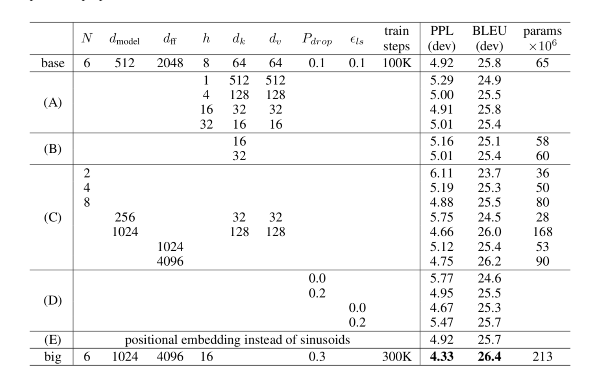
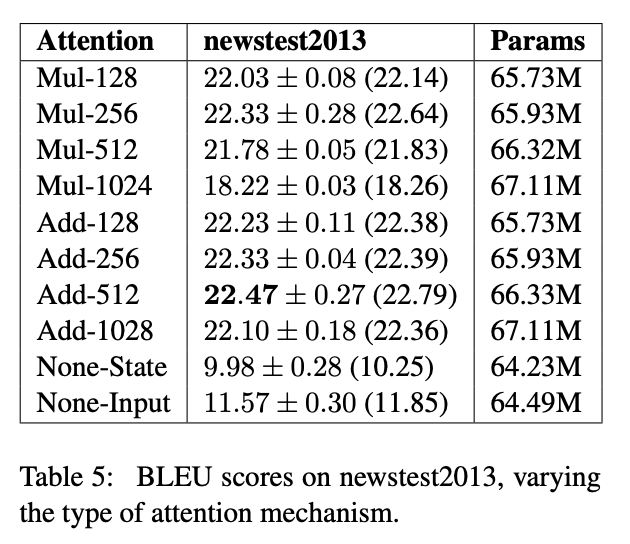

# 答案解析(1)—史上最全Transformer面试题：灵魂20问帮你彻底搞定Transformer

### 简单介绍

之前的20个问题的文章在这里：

https://zhuanlan.zhihu.com/p/148656446

其实这20个问题不是让大家背答案，而是为了帮助大家梳理 transformer的相关知识点，所以你注意看会发现我的问题也是有某种顺序的。
问题基本上都可以在网上找到答案，所以大家可以先去搜一搜，自己理解一下，我也不会重新把答案回答一遍，而是列出来我看到的比较好的回答，然后加上点自己的注解帮助大家理解，在这里感谢那些大佬回答者，今天整理了其中的五个，剩下的我抽空在整理一下。

这里我先小声说一下，写这些笔记有两个目的。

一个是方便大家，好多题目都太散了，没有人归纳一下。

二个就是方便自己重新复习一遍，所以我也不可能是直接把答案一粘就完事，这对我自己就没啥帮助了。所以没啥别的目的，不是为了博关注粉丝之类的，因为这些如果做不到大V基本没啥用，我也没那时间去经营成为大V，工作忙的要死，就是想要有个一起沟通的渠道而已。

公众号/知乎/github基本同步更新，大家关注哪一个都可以，不过可能微信链接跳转不方便，知乎编辑不方便，github对有些同学不太方便打开。大家看自己情况关注吧。

### 正文
##### 1.Transformer为何使用多头注意力机制？（为什么不使用一个头）

Transformer为何使用多头注意力机制？（为什么不使用一个头）
答案解析参考这里：为什么Transformer 需要进行 Multi-head Attention？
https://www.zhihu.com/question/341222779

注解：简单回答就是，多头保证了transformer可以注意到不同子空间的信息，捕捉到更加丰富的特征信息。其实本质上是论文原作者发现这样效果确实好，我把作者的实验图发在下面：



#### 2.Transformer为什么Q和K使用不同的权重矩阵生成，为何不能使用同一个值进行自身的点乘？

答案解析参考这里：transformer中为什么使用不同的K 和 Q， 为什么不能使用同一个值？ - 知乎
https://www.zhihu.com/question/319339652

注解：简单回答就是，使用Q/K/V不相同可以保证在不同空间进行投影，增强了表达能力，提高了泛化能力。

#### 3.Transformer计算attention的时候为何选择点乘而不是加法？两者计算复杂度和效果上有什么区别？

答案解析：为了计算更快。矩阵加法在加法这一块的计算量确实简单，但是作为一个整体计算attention的时候相当于一个隐层，整体计算量和点积相似。在效果上来说，从实验分析，两者的效果和dk相关，dk越大，加法的效果越显著。更具体的结果，大家可以看一下实验图(从莲子同学那里看到的，专门去看了一下论文)：



#### 4.为什么在进行softmax之前需要对attention进行scaled（为什么除以dk的平方根），并使用公式推导进行讲解
答案解析参考这里：transformer中的attention为什么scaled? - LinT的回答 - 知乎
https://www.zhihu.com/question/339723385/answer/782509914

注解：针对大佬回答的第二个问题，也就是方差的问题，我简单的写了一个代码验证了一下，不愿意看公式推导的同学直接看代码结果就可以。代码如下:

```python 
import numpy as np 
arr1=np.random.normal(size=(3,1000))
arr2=np.random.normal(size=(3,1000))
result=np.dot(arr1.T,arr2)
arr_var=np.var(result)
print(arr_var) #result: 2.9 (基本上就是3，和就是我们设定的维度)
```


#### 5.在计算attention score的时候如何对padding做mask操作？

答案解析：padding位置置为负无穷(一般来说-1000就可以)。对于这一点，涉及到batch_size之类的，具体的大家可以看一下抱抱脸实现的源代码，位置在这里：

https://github.com/huggingface/transformers/blob/aa6a29bc25b663e1311c5c4fb96b004cf8a6d2b6/src/transformers/modeling_bert.py#L720

这个是最新版，比较老版本的实现地址我也罗列一下，应该没啥区别，我没细看，一直用的老版本的：

https://github.com/DA-southampton/Read_Bert_Code/blob/0605619582f1bcd27144e2d76fac93cb16e44055/bert_read_step_to_step/transformers/modeling_bert.py#L607